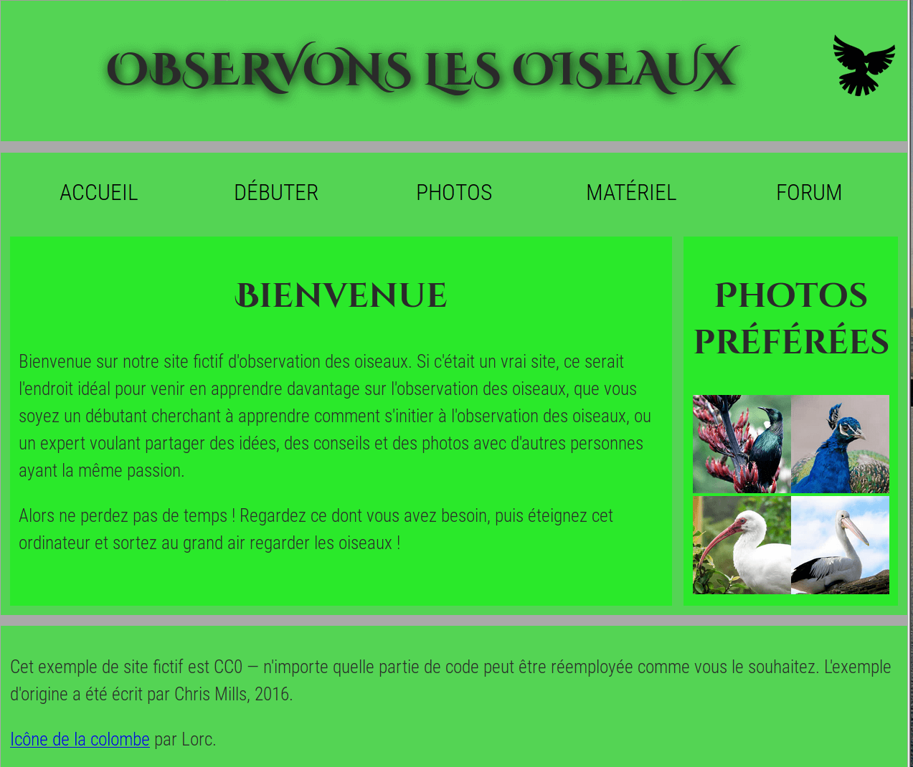

{{LearnSidebar}}
{{PreviousNext("Apprendre/HTML/Introduction_à_HTML/Marking_up_a_letter", "Apprendre/HTML/Introduction_à_HTML")}}

Il est essentiel de savoir structurer une page de contenu prête à être mise en forme grâce au CSS. Cette évaluation va vous permettre de vous tester sur votre capacité à réfléchir au rendu visuel final d'une page et à choisir la sémantique structurelle appropriée pour construire une bonne mise en page.

<table class="standard-table">
  <tbody>
    <tr>
      <th scope="row">Prérequis :</th>
      <td>
        Avant de commencer cette évaluation, vous devriez avoir déjà travaillé
        sur le reste du cours, en particulier sur
        <a
          href="/fr/docs/Apprendre/HTML/Introduction_%C3%A0_HTML/Document_and_website_structure"
          >Structure de Site Web et de document</a
        >
      </td>
    </tr>
    <tr>
      <th scope="row">Objectif :</th>
      <td>
        Tester vos connaissances sur la structure des pages web et d'une
        représentation prospective d'un design de mise en page avec un balisage.
      </td>
    </tr>
  </tbody>
</table>

## Point de départ

Pour commencer cet exercice, vous pouvez télécharger [l'archive contenant les fichiers nécessaires](https://github.com/mdn/learning-area/blob/master/html/introduction-to-html/structuring-a-page-of-content-start/assets.zip?raw=true) à cette évaluation. Elle contient :

- le fichier HTML auquel vous allez devoir ajouter le balisage structurel,
- le fichier CSS pour styliser la page,
- les images utilisées dans la page.

Décompressez l'archive sur votre ordinateur, ou bien utilisez un site web comme [JSBin](http://jsbin.com/) ou [Thimble](https://thimble.mozilla.org/) pour faire votre évaluation.

## Aperçu du projet

Dans ce projet, l'objectif est d'ajouter des éléments structurels au contenu de la page d'accueil d'un site d'observation d'oiseaux pour parfaire sa mise en page. La page devra contenir :

- un en‑tête sur toute la largeur de la page avec le titre de la page, le logo du site et le menu de navigation. Le titre et le logo apparaîtront côte à côte une fois le style appliqué, et la navigation sera juste au‑dessous du menu,
- une zone de contenu principal de deux colonnes : un bloc principal avec le texte de bienvenue et une barre latérale avec des vignettes d'images,
- un pied de page avec les informations de droits d'auteur et les crédits.

Vous devez ajouter les enveloppes appropriées pour&nbsp;:

- l'en-tête
- le menu de navigation
- le contenu principal
- le texte de bienvenue
- la barre latérale avec les images
- le pied de page

Vous devez aussi

- appliquer à la page les CSS fournies en ajoutant un élément {{htmlelement("link")}} juste au‑dessous de celui existant.

## Conseils et astuces

- Utilisez le «&nbsp;[W3C HTML validator&nbsp;»](https://validator.w3.org/) pour valider votre HTML&nbsp;; vous aurez des points bonus si la validation s'opère autant que possible (la ligne «&nbsp;googleapis&nbsp;» est une ligne utilisée pour importer des polices personnalisées dans la page à partir du service «&nbsp;Google Fonts » ; elle ne sera pas validée, donc ne vous en inquiétez pas).
- Il n'est pas nécessaire de connaître quoi que ce soit des CSS pour faire cet exercice&nbsp;; vous avez juste besoin de placer les CSS fournies dans l'élément HTML.
- Les CSS jointes sont conçues de telle sorte que les éléments structuraux adéquats ont été ajoutés dans le balisage, ils apparaîtront en vert dans le rendu de la page.
- Si vous êtes bloqué et ne voyez pas où mettre tel élément, cela peut vous aider de tracer un diagramme des blocs de disposition de la page et d'écrire sur chaque élément ce qui, à votre avis devrait envelopper chaque bloc.

## Exemple

La capture d'écran suivante montre un exemple de ce à quoi la page d'accueil peut ressembler après avoir été balisée.

## Évaluation

Si cette évaluation fait partie d'un cours organisé, vous devez pouvoir donner votre travail à votre professeur/formateur pour notation. Si vous faites de l'auto‑formation vous pouvez obtenir un guide d'auto‑évaluation en le demandant sur le [Learning Area Discourse thread](https://discourse.mozilla-community.org/t/learning-web-development-marking-guides-and-questions/16294) ou sur le canal IRC [#mdn](irc://irc.mozilla.org/mdn) sur [Mozilla IRC](https://wiki.mozilla.org/IRC). Essayez l'exercice d'abord — il n'y a rien à gagner à tricher&nbsp;!

{{PreviousMenu("Apprendre/HTML/Introduction_à_HTML/Marking_up_a_letter", "Apprendre/HTML/Introduction_à_HTML")}}
