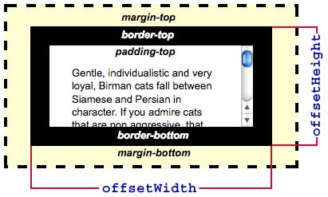
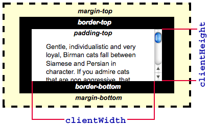

{{DefaultAPISidebar("CSSOM View")}}

要素の幅と高さを決定するために見ることがあるプロパティはいくつかあり、どれがニーズに適しているかを特定するのが難しい場合があります。この記事は、その決定に役立つように作られています。これらのプロパティはすべて読み取り専用であることに注意してください。要素の幅と高さを設定する場合は、 {{CSSxRef("width")}} と {{CSSxRef("height")}}、またはそれをオーバーライドする {{CSSxRef("min-width")}} と {{CSSxRef("max-width")}}、および {{CSSxRef("min-height")}} と {{CSSxRef("max-height")}} プロパティを使用してください。

## どれくらいの空間を占めるのか

表示されているコンテンツの幅、スクロールバー (存在する場合)、パディング、境界を含んだ、要素が占める空間の合計量を知る必要がある場合は、{{DOMxRef("HTMLElement.offsetWidth")}} プロパティと {{DOMxRef("HTMLElement.offsetHeight")}} プロパティを使用します。 ほとんどの場合、要素に適用される変換がなければ、これらは {{DOMxRef("Element.getBoundingClientRect()")}} の幅と高さと同じです。変換がある場合、`offsetWidth` および `offsetHeight` は要素のレイアウトの幅と高さを返し、`getBoundingClientRect()` はレンダリングの幅と高さを返します。例として、要素に `width: 100px;` と `transform: scale(0.5);` がある場合 `getBoundingClientRect()` は幅として 50 を返し、`offsetWidth` は 100 を返します。

## 表示されるコンテンツの大きさ

パディングを含み、境界、マージン、スクロールバーは含まない、実際に表示されるコンテンツが占める空間を知る必要がある場合は、 {{DOMxRef("Element.clientWidth")}} プロパティと {{DOMxRef("Element.clientHeight")}} プロパティを使用します。

## コンテンツの大きさはどれくらいか

コンテンツの実際のサイズを知る必要がある場合は、現在どれだけ表示されているかに関係なく、{{DOMxRef("Element.scrollWidth")}} プロパティと {{DOMxRef("Element.scrollHeight")}} プロパティを使用する必要があります。 これらは、スクロールバーの使用により現在一部のみが表示されている場合でも、要素のコンテンツ全体の幅と高さを返します。

例えば、 600x400 ピクセルの要素が 300x300 ピクセルのスクロールボックス内に表示されている場合、`scrollWidth` は 600 を返し、`scrollHeight` は 400 を返します。

## 関連情報

- <https://www.w3.org/TR/cssom-view-1/>
- [MSDN: 要素の寸法と位置の測定](<https://docs.microsoft.com/en-us/previous-versions//hh781509(v=vs.85)>) (英語)
