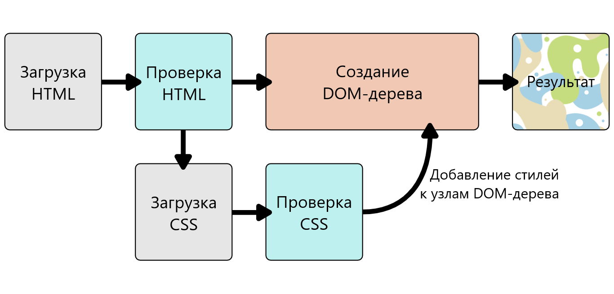

{{LearnSidebar}}
{{PreviousMenuNext("Learn/CSS/First_steps/How_CSS_is_structured", "Learn/CSS/First_steps/Using_your_new_knowledge", "Learn/CSS/First_steps")}}

Мы уже изучили основы CSS, для чего он нужен и как создавать простые таблицы стилей. В этом уроке мы посмотрим, как браузер обрабатывает CSS и HTML и выводит содержимое на веб-страницу.

| Необходимые знания: | Основы компьютерной грамотности, [базовое программное обеспечение](/ru/docs/Learn/Getting_started_with_the_web/Установка_базового_программного_обеспечения), умение [умение работать с файлами](/ru/docs/Learn/Getting_started_with_the_web/Dealing_with_files) и начальные знания HTML (рекомендуется изучить [Введение в HTML](/ru/docs/Learn/HTML/Введение_в_HTML)). |
| ------------------- | ----------------------------------------------------------------------------------------------------------------------------------------------------------------------------------------------------------------------------------------------------------------------------------------------------------------------------------------------------------------------- |
| Задача:             | Понимать основы того, как браузер анализирует CSS и HTML и что происходит когда браузер встречает неизвестные CSS стили                                                                                                                                                                                                                                                 |

## Как работает CSS?

Когда браузер отображает документ, он должен совместить его содержимое с его стилями. Этот процесс идёт в несколько этапов, о которых мы сейчас поговорим. Держите в уме, что это очень упрощённая версия того как браузер действительно загружает веб-страницу, а также то, что разные браузеры делают это по разному. Но, происходит, грубо говоря, следующее:

1. Браузер получает HTML-страницу (например, из Интернета)
2. Преобразует {{Glossary("HTML")}} в {{Glossary("DOM")}} (_Document Object Model_). DOM (или DOM-дерево) - это представление страницы в памяти компьютера. Подробнее на DOM мы остановимся чуть позже.
3. Затем браузер забирает все ресурсы и описания, связанные с HTML-документом, например: встроенные картинки, видео ... и стили CSS! JavaScript присоединяется чуть позже и мы пока не будем говорить об этом, чтобы все не усложнять.
4. После этого браузер анализирует полученный CSS код, сортирует описанные там правила в зависимости от их селекторов и раскладывает их в различные «корзины»: элементы, классы, идентификаторы(ID) и т.п. Основываясь на найденных селекторах браузер понимает какие правила относятся к определённым «узлам» в DOM-дереве и применяет их по мере необходимости (этот промежуточный шаг называют «формированием дерева представления» или «формированием дерева рендеринга»)
5. Дерево представления (_render tree_) формируется в том порядке, в каком оно затем должно будет отображаться, когда все правила будут применены.
6. Затем происходит визуальное отображение контента на странице (этот этап называется «отрисовкой»)

Диаграмма демонстрирует этот процесс.



## DOM-дерево

DOM напоминает дерево. Каждый элемент, атрибут, отрывок текста становится {{Glossary("Node/DOM","DOM node")}} в разметке. DOM-узлы определяются их отношением с другими узлами. Некоторые родительские элементы имеют дочерние, а у дочерних элементов есть братские.

Понимание DOM позволит вам разрабатывать, отлаживать и поддерживать ваш CSS, потому что именно в DOM-дереве ваши таблицы стилей и код встречаются. Когда вы начнёте работать с браузерным DevTools(инструменты для разработки) вы будете перемещаться по DOM при выборе элементов чтобы увидеть какие правила применяются.

## Как представлено DOM-дерево

Вместо длинного, нудного объяснения взглянем лучше на пример, чтобы понять, как HTML-код преобразуется в DOM.

Возьмём следующий пример:

```html
<p>
  Let's use:
  <span>Cascading</span>
  <span>Style</span>
  <span>Sheets</span>
</p>
```

В DOM-дереве узел, соответствующий элементу `<p>`, — это родительский элемент. Его дочерние элементы — текст и три элемента `<span>`. Узлы `SPAN` также будут родителями — с текстом в качестве дочерних элементов:

```
P
├─ "Let's use:"
├─ SPAN
|  └─ "Cascading"
├─ SPAN
|  └─ "Style"
└─ SPAN
   └─ "Sheets"
```

Вот как браузер преобразует HTML-код — он загружает DOM-дерево, и в результате мы получим это:

{{EmbedLiveSample('A_real_DOM_representation', '100%', 55)}}

```css hidden
p {
  margin: 0;
}
```

## Добавление CSS в DOM

Допустим, мы добавили таблицу стилей к нашему примеру:

```html
<p>
  Let's use:
  <span>Cascading</span>
  <span>Style</span>
  <span>Sheets</span>
</p>
```

А вот CSS-код:

```css
span {
  border: 1px solid black;
  background-color: lime;
}
```

Браузер загрузит HTML-код, преобразует его в DOM и только потом загрузит CSS. Так как у нас всего одно правило, браузер загрузит CSS очень быстро! Это правило будет добавлено к каждому из трёх элементов `<span>`. После этого информация будет отображена на экране.

Новый результат:

{{EmbedLiveSample('Добавление_CSS_в_DOM', '100%', 55)}}

В статье [Отладка CSS](/ru/docs/Learn/CSS/Building_blocks/Debugging_CSS) мы будем использовать браузер DevTools для отладки CSS.

## Что происходит, когда браузер не понимает CSS?

[В предыдущем уроке](/ru/docs/Learn/CSS/First_steps/Что_такое_CSS#Поддержка_браузера) я упомянул, что некоторые браузеры могут не поддерживать новые функции CSS. Вдобавок не все используют новейшие версии браузеров. Зная, что CSS разрабатывается всё время, вы можете поразиться и крайне ужаснуться тому, что происходит, если браузер не распознаёт объявление или селектор. Что же произойдёт?

— Да ничего: браузер просто пропустит это!

Если браузер встретит свойство, которое он не понимает, он просто-напросто проигнорирует его и двинется дальше. Он сделает так, если вы допустите опечатку или ошибку в свойстве или значении или если он не поддерживает какое-либо свойство или значение.

Если же браузер встретит селектор, который он не распознаёт, то он просто пропустит данное правило и двинется дальше.

Ниже я использовал британское написание слова _color_, что делает свойство некорректным. Поэтому текст не будет синим. Однако всё остальное будет работать; пропущено только недействительное свойство.

```html
<p>I want this text to be large, bold and blue.</p>
```

```css
p {
  font-weight: bold;
  colour: blue; /* некорректное написание свойства цвета */
  font-size: 200%;
}
```

{{EmbedLiveSample('Skipping_example', '100%', 200)}}

Такое поведение можно использовать, например, при добавлении новых функций CSS в качестве дополнения, причём вы будете уверены, что ничего не сломается, если браузер не распознает элемент. Вы можете использовать два правила с одинаковыми уровнями спецификации: одно — в качестве альтернативы для случая, если браузер не поддерживает нововведение.

Это хорошо применяется, если вы хотите использовать величину, не использующуюся везде в документе. К примеру, некоторые старые браузеры не поддерживают `calc()` как значение. Я добавлю резерв — значение в px, затем задам ширину с помощью функции `calc()`, равной `100% - 50px`. Старые браузеры используют пиксельное значение, потому что не распознают `calc()`. Новые браузеры используют `calc()` так как эта строка появляется позже в каскаде.

```css
.box {
  width: 500px;
  width: calc(100% - 50px);
}
```

## Завершение

Вы почти закончили модуль; осталось только одно. В следующей статье вы попрактикуетесь в [использовании ваших новых знаний](/ru/docs/Learn/CSS/First_steps/Using_your_new_knowledge).

{{PreviousMenuNext("Learn/CSS/First_steps/How_CSS_is_structured", "Learn/CSS/First_steps/Using_your_new_knowledge", "Learn/CSS/First_steps")}}

## В этом модуле

1. [Что такое CSS?](/ru/docs/Learn/CSS/First_steps/Что_такое_CSS)
2. [Начало работы с CSS](/ru/docs/Learn/CSS/First_steps/Getting_started)
3. [Как структурирован CSS](/ru/docs/Learn/CSS/First_steps/%D0%9A%D0%B0%D0%BA_%D1%81%D1%82%D1%80%D1%83%D0%BA%D1%82%D1%83%D1%80%D0%B8%D1%80%D0%BE%D0%B2%D0%B0%D0%BD_CSS)
4. [Как работает CSS](/ru/docs/Learn/CSS/First_steps/How_CSS_works)
5. [Использование ваших новых знаний](/ru/docs/Learn/CSS/First_steps/Using_your_new_knowledge)
